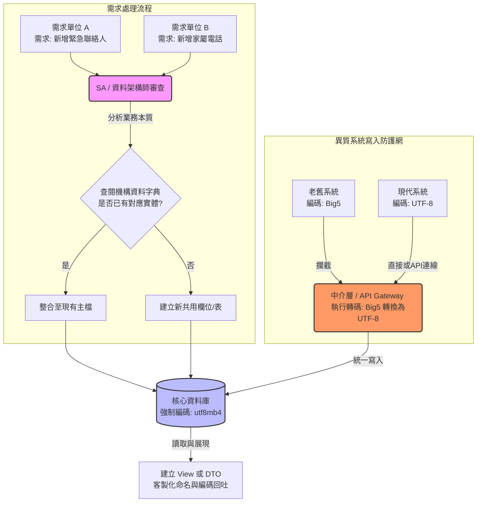

# 企業級資料庫欄位整合與管理畫布 (Database Field Integration Canvas)

## 📌 現況痛點 (Problem Statement)
在大型機構中，歷史遺留系統與現代應用程式共存，常導致以下資料管理危機：
1. **資料孤島與重複 (Data Silos & Redundancy)：** 各單位對同一業務本質提出不同欄位需求（如 A單位的「緊急電話」與 B單位的「家屬手機」），導致 Schema 膨脹與資料不一致。
2. **編碼混亂與亂碼 (Encoding Inconsistency)：** 異質系統（如老舊系統與新系統）寫入同一個資料庫時，使用不同的字元編碼（例如 Big5 與 UTF-8 混用），導致顯示亂碼、搜尋失效。

---

## 🎯 核心策略 (Core Strategy)
**「單一真實來源 (SSOT)、統一編碼標準、表層客製轉譯」**
攔截需求進行業務本質分析，統一實體儲存格式與編碼，並在系統邊界進行轉換。

---

## 🏗️ 五大執行支柱 (5 Pillars of Execution)

### 1. 流程與治理面 (Process & Governance)
*   **設置審查關卡：** 需求不可直達開發者，須經「系統分析師 (SA)」或「資料架構師」進行需求轉譯與收斂。
*   **建立資料字典 (Data Dictionary)：** 建立全機構共用的 Master Data 綱要。接到新需求時，優先「查表」確認屬性是否已存在。
*   **界定資料擁有者 (Data Owner)：** 釐清共用資料的維護權責（如：通訊地址唯一修改權在人事室，其餘單位僅供讀取）。

### 2. 實體架構與編碼標準 (Physical Architecture & Encoding)
*   **主檔與明細分離：** 將共用的核心資料集中於主檔（如 `User_Master`）。各單位的業務表單僅儲存 ID 作為外來鍵。
*   **一對多設計：** 若屬性具備多重性，建立獨立的明細表以「類別」區分用途，拒絕無限擴充單一表單。
*   **強制資料庫層級編碼：** **資料庫本身、資料表及欄位的 Collation 必須絕對統一（現代標準強烈建議 `utf8mb4`）。** 嚴禁在資料庫層級容忍混合編碼。

### 3. 資料寫入與邊界轉譯 (Data Writing & Boundary Translation)
*   **建立 API / 中介層 (Middleware Gateway)：** 這是解決新舊系統編碼衝突的關鍵。老舊系統**禁止直接直連 (Direct Connect)** 核心資料庫，必須透過中介層（API 或 Database Proxy）進行寫入。
*   **強制轉碼 (Encoding Conversion)：** 在中介層攔截老系統送來的請求，如果老系統送出 Big5，中介層負責將其轉為 UTF-8 後再寫入資料庫；讀取時，再從 UTF-8 轉回 Big5 餵給老系統。
*   **連線字串 (Connection String) 管理：** 確保所有應用程式連線字串中明確指定編碼（如 `characterEncoding=UTF-8`），防止依賴作業系統或驅動程式的預設值。

### 4. 展現與邏輯面 (Presentation & Logic)
*   **資料庫視圖 (DB Views)：** 為不同單位建立專屬 View，將欄位別名 (Alias) 設定為該單位習慣的業務術語。
*   **DTO 映射：** 透過後端程式在回傳 JSON 資料時，動態將共用欄位名稱轉換為前端或各單位系統要求的要求的 Key。

### 5. 彈性預防與清理 (Flexibility & Cleaning)
*   **JSON / EAV 模型擴充：** 針對極度冷門、特規屬性使用 JSON 欄位或 EAV 表儲存，避免頻繁修改核心 Schema。
*   **歷史髒資料清洗 (Data Cleansing)：** 針對已存在的亂碼，建立排程程式或一次性腳本（ETL 工具），透過特徵比對或人工輔助，逐步將歷史資料正規化並轉譯為統一編碼。

---

## 🔄 整合與防護標準流程圖 (Workflow)

