# 歡迎使用 VGHTPE-HR Markdown & Mermai

這是一個即時編輯器，可以將您的 Markdown 內容與 Mermaid 圖表程式碼轉換為視覺化的畫面。
以下完整收錄了 Mermaid 官方內建支援的 **20 種各式圖表範例**：

## 1. 流程圖 (Flowchart)
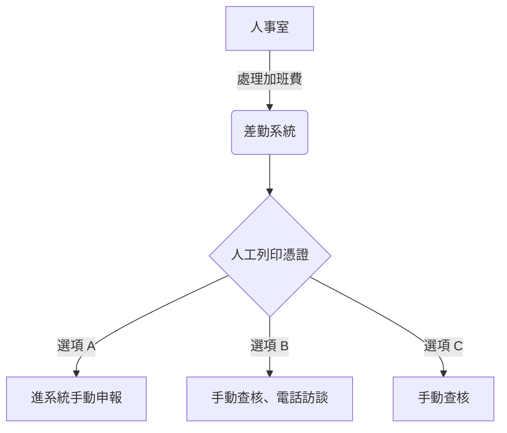
```mermaid
graph TD
    A[人事室] -->|處理加班費| B(差勤系統)
    B --> C{人工列印憑證}
    C -->|選項 A| D[進系統手動申報]
    C -->|選項 B| E[手動查核、電話訪談]
    C -->|選項 C| F[手動查核]
```

## 2. 循序圖 (Sequence Diagram)
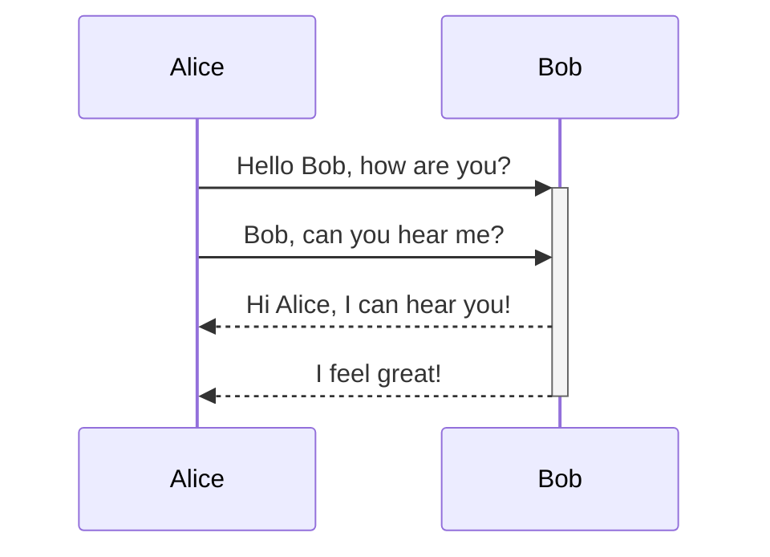
```mermaid
sequenceDiagram
    participant Alice
    participant Bob
    Alice ->>+ Bob: Hello Bob, how are you?
    Alice ->> Bob: Bob, can you hear me?
    Bob -->> Alice: Hi Alice, I can hear you!
    Bob -->>- Alice: I feel great!
```

## 3. 類別圖 (Class Diagram)
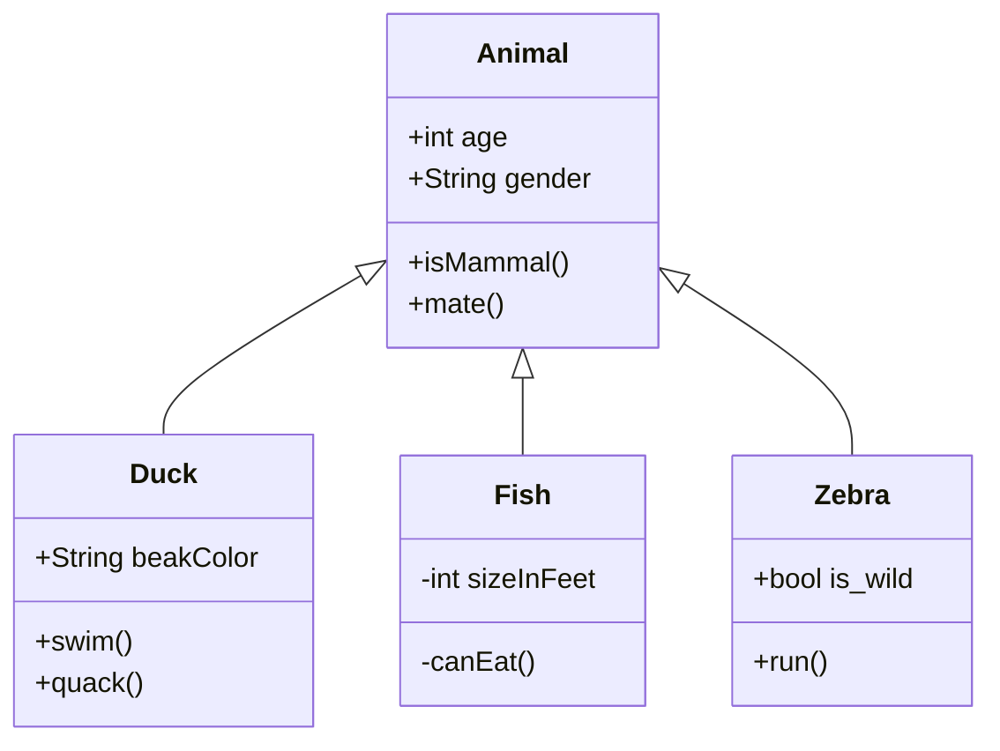
```mermaid
classDiagram
    Animal <|-- Duck
    Animal <|-- Fish
    Animal <|-- Zebra
    Animal : +int age
    Animal : +String gender
    Animal: +isMammal()
    Animal: +mate()
    class Duck{
        +String beakColor
        +swim()
        +quack()
    }
    class Fish{
        -int sizeInFeet
        -canEat()
    }
    class Zebra{
        +bool is_wild
        +run()
    }
```

## 4. 狀態圖 (State Diagram)
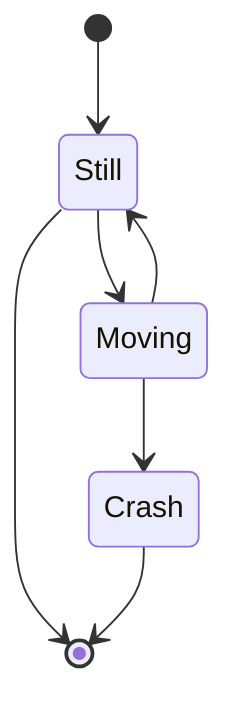
```mermaid
stateDiagram-v2
    [*] --> Still
    Still --> [*]
    Still --> Moving
    Moving --> Still
    Moving --> Crash
    Crash --> [*]
```

## 5. 實體關聯圖 (Entity Relationship Diagram)
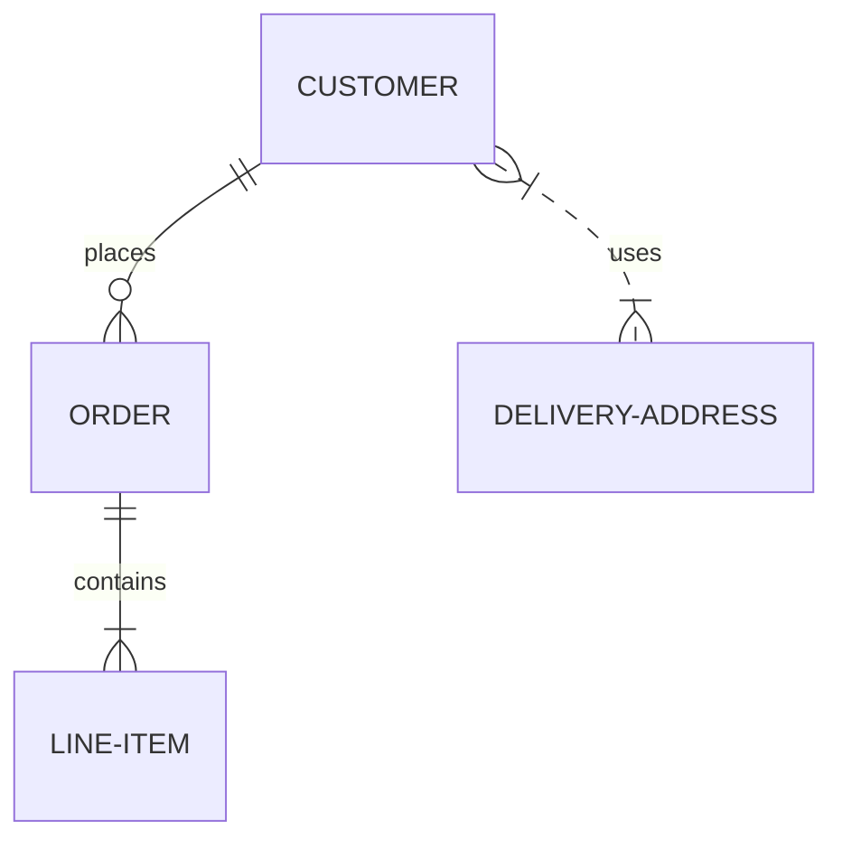
```mermaid
erDiagram
    CUSTOMER ||--o{ ORDER : places
    ORDER ||--|{ LINE-ITEM : contains
    CUSTOMER }|..|{ DELIVERY-ADDRESS : uses
```

## 6. 使用者旅程圖 (User Journey)
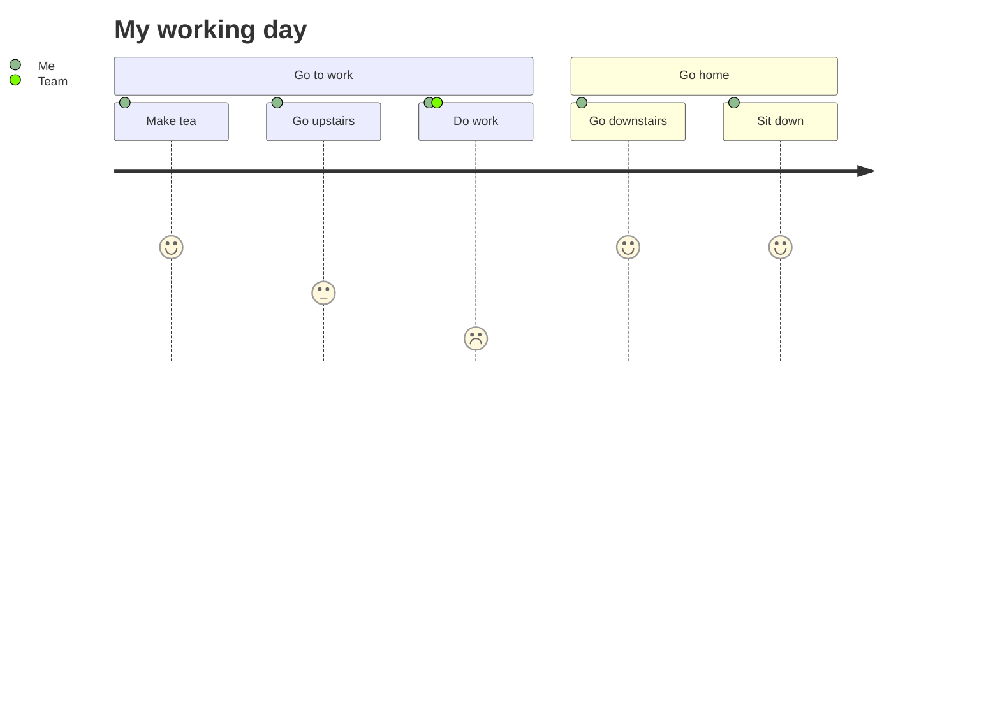
```mermaid
journey
    title My working day
    section Go to work
      Make tea: 5: Me
      Go upstairs: 3: Me
      Do work: 1: Me, Team
    section Go home
      Go downstairs: 5: Me
      Sit down: 5: Me
```

## 7. 甘特圖 (Gantt Chart)
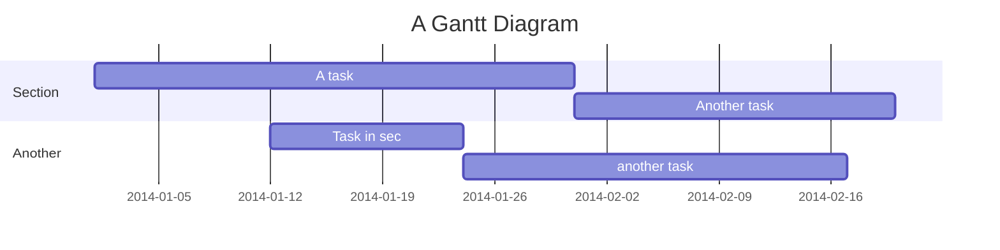
```mermaid
gantt
    title A Gantt Diagram
    dateFormat  YYYY-MM-DD
    section Section
    A task           :a1, 2014-01-01, 30d
    Another task     :after a1  , 20d
    section Another
    Task in sec      :2014-01-12  , 12d
    another task     : 24d
```

## 8. 圓餅圖 (Pie Chart)
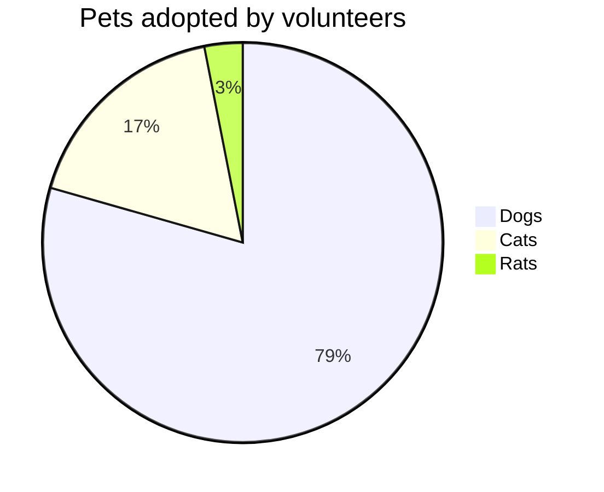
```mermaid
pie title Pets adopted by volunteers
    "Dogs" : 386
    "Cats" : 85
    "Rats" : 15
```

## 9. 象限圖 (Quadrant Chart)
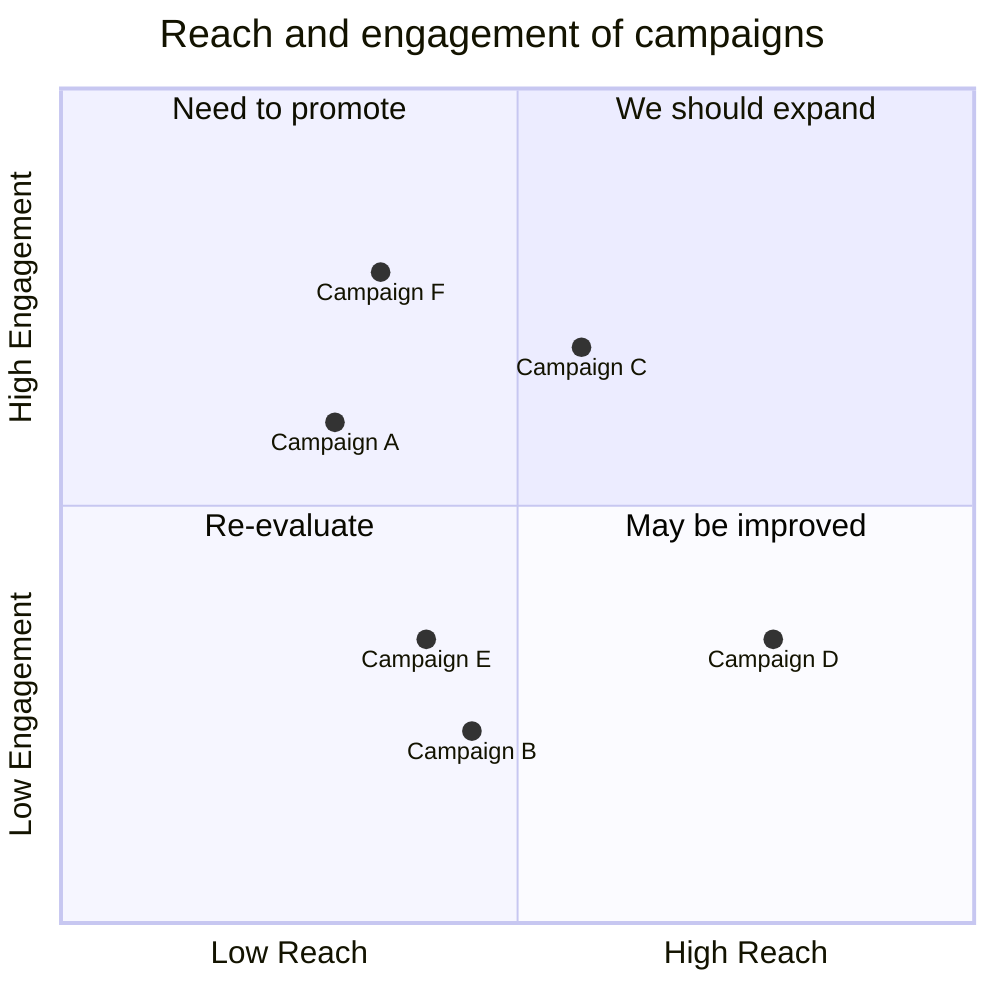
```mermaid
quadrantChart
    title Reach and engagement of campaigns
    x-axis Low Reach --> High Reach
    y-axis Low Engagement --> High Engagement
    quadrant-1 We should expand
    quadrant-2 Need to promote
    quadrant-3 Re-evaluate
    quadrant-4 May be improved
    Campaign A: [0.3, 0.6]
    Campaign B: [0.45, 0.23]
    Campaign C: [0.57, 0.69]
    Campaign D: [0.78, 0.34]
    Campaign E: [0.40, 0.34]
    Campaign F: [0.35, 0.78]
```

## 10. 需求圖 (Requirement Diagram)
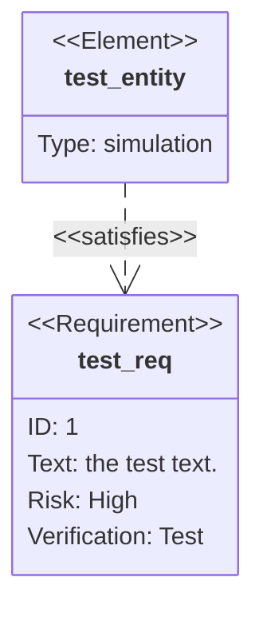
```mermaid
requirementDiagram

requirement test_req {
id: 1
text: the test text.
risk: high
verifymethod: test
}

element test_entity {
type: simulation
}

test_entity - satisfies -> test_req
```

## 11. Git 圖 (Gitgraph)
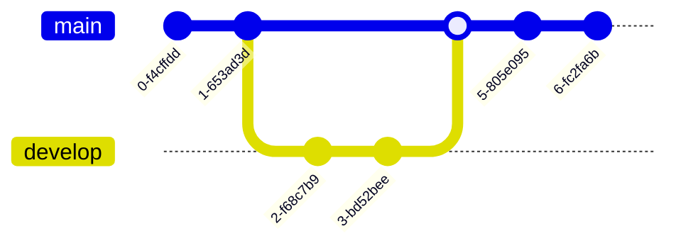
```mermaid
gitGraph
    commit
    commit
    branch develop
    checkout develop
    commit
    commit
    checkout main
    merge develop
    commit
    commit
```

## 12. C4 架構圖 (C4 Diagram)
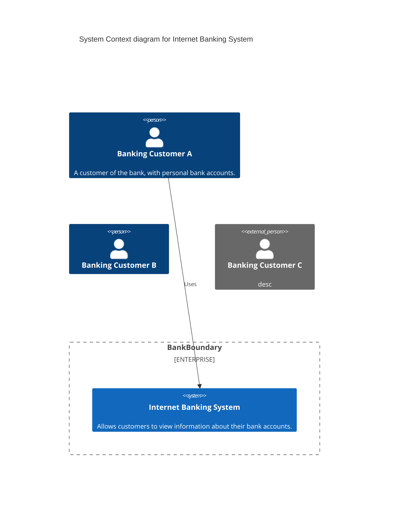
```mermaid
C4Context
    title System Context diagram for Internet Banking System
    Person(customerA, "Banking Customer A", "A customer of the bank, with personal bank accounts.")
    Person(customerB, "Banking Customer B")
    Person_Ext(customerC, "Banking Customer C", "desc")
    Enterprise_Boundary(b0, "BankBoundary") {
      System(SystemAA, "Internet Banking System", "Allows customers to view information about their bank accounts.")
    }
    Rel(customerA, SystemAA, "Uses")
```

## 13. 心智圖 (Mindmap)
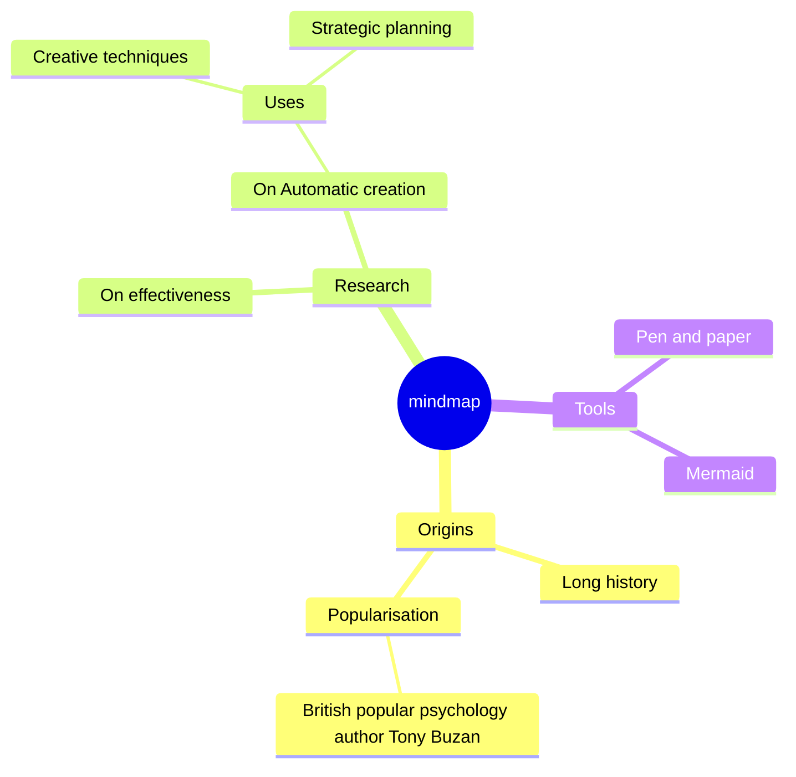
```mermaid
mindmap
  root((mindmap))
    Origins
      Long history
      Popularisation
        British popular psychology author Tony Buzan
    Research
      On effectiveness
      On Automatic creation
        Uses
            Creative techniques
            Strategic planning
    Tools
      Pen and paper
      Mermaid
```

## 14. 時間軸 (Timeline)
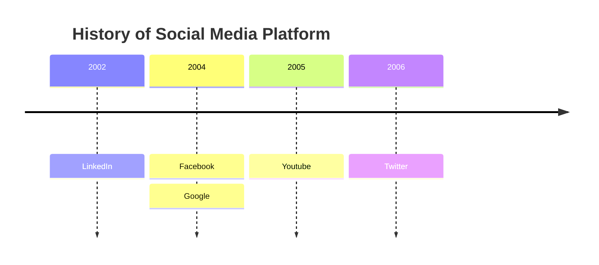
```mermaid
timeline
    title History of Social Media Platform
    2002 : LinkedIn
    2004 : Facebook
         : Google
    2005 : Youtube
    2006 : Twitter
```

## 15. 桑基圖 (Sankey Diagram)
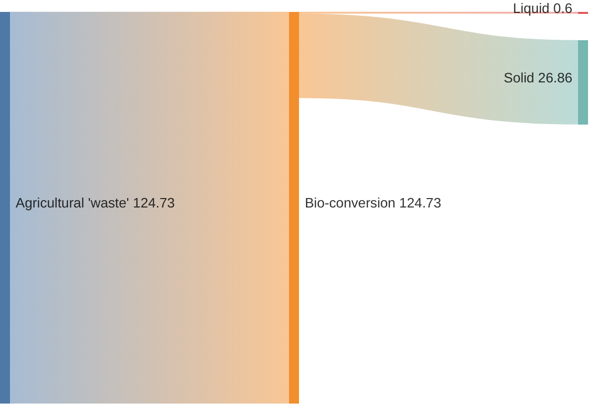
```mermaid
sankey-beta
Agricultural 'waste',Bio-conversion,124.729
Bio-conversion,Liquid,0.597
Bio-conversion,Solid,26.862
```

## 16. XY 座標圖 (XYChart)
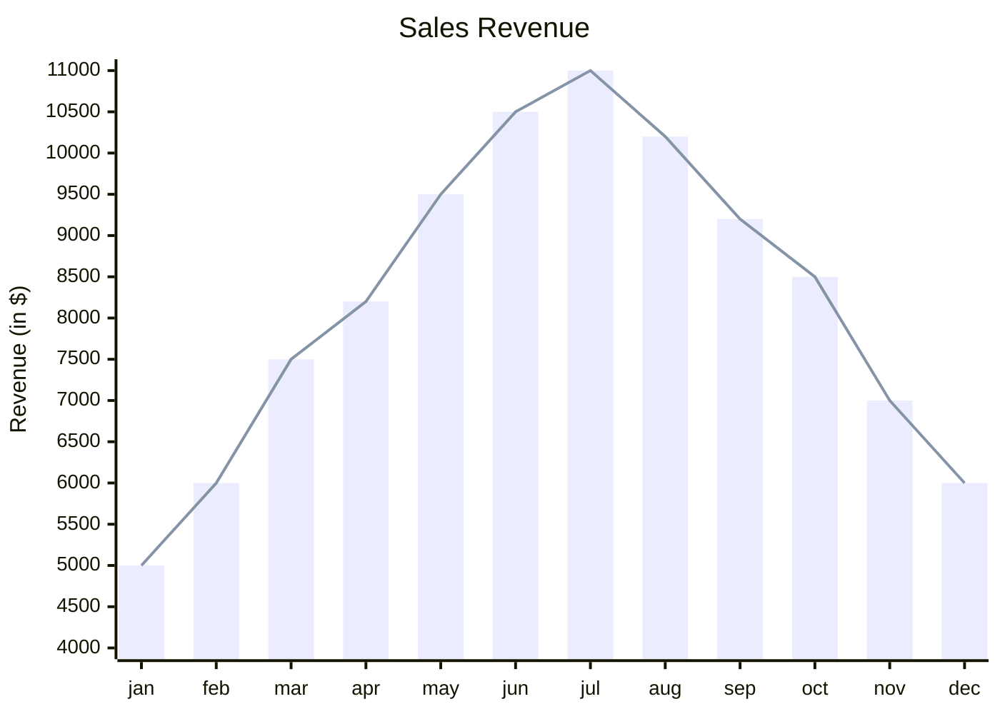
```mermaid
xychart-beta
    title "Sales Revenue"
    x-axis [jan, feb, mar, apr, may, jun, jul, aug, sep, oct, nov, dec]
    y-axis "Revenue (in $)" 4000 --> 11000
    bar [5000, 6000, 7500, 8200, 9500, 10500, 11000, 10200, 9200, 8500, 7000, 6000]
    line [5000, 6000, 7500, 8200, 9500, 10500, 11000, 10200, 9200, 8500, 7000, 6000]
```

## 17. 區塊圖 (Block Diagram)
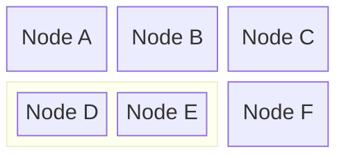
```mermaid
block-beta
  columns 3
  A["Node A"]
  B["Node B"]
  C["Node C"]
  block:group1:2
    D["Node D"]
    E["Node E"]
  end
  F["Node F"]
```

## 18. 封包圖 (Packet Diagram)
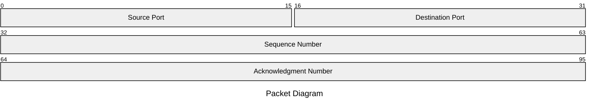
```mermaid
packet-beta
  title Packet Diagram
  0-15: "Source Port"
  16-31: "Destination Port"
  32-63: "Sequence Number"
  64-95: "Acknowledgment Number"
```

## 19. 系統架構圖 (Architecture)
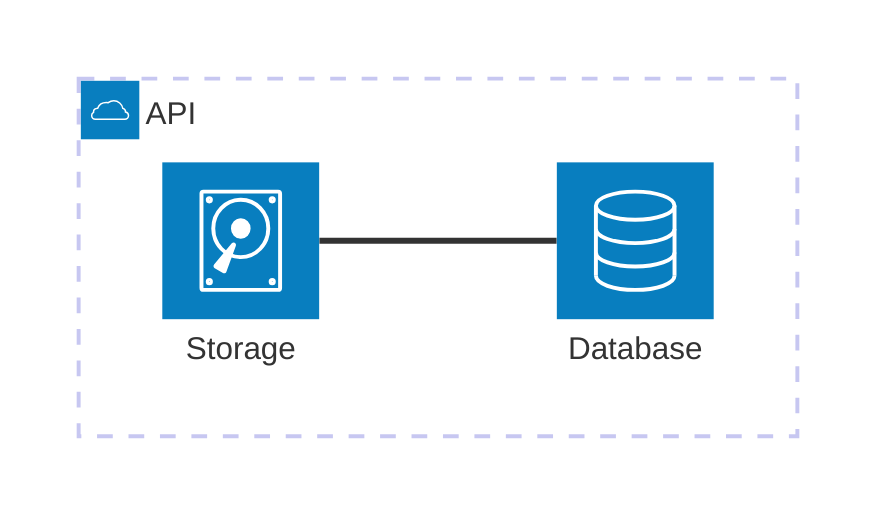
```mermaid
architecture-beta
    group api(cloud)[API]
    service db(database)[Database] in api
    service disk(disk)[Storage] in api
    db:L -- R:disk
```

## 20. 看板 (Kanban)
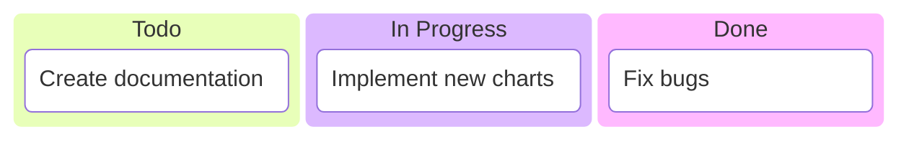
```mermaid
kanban
  Todo
    [Create documentation]
  In Progress
    [Implement new charts]
  Done
    [Fix bugs]
```

---
*提示：您可以試著修改左側的程式碼，右側會即時更新喔！*