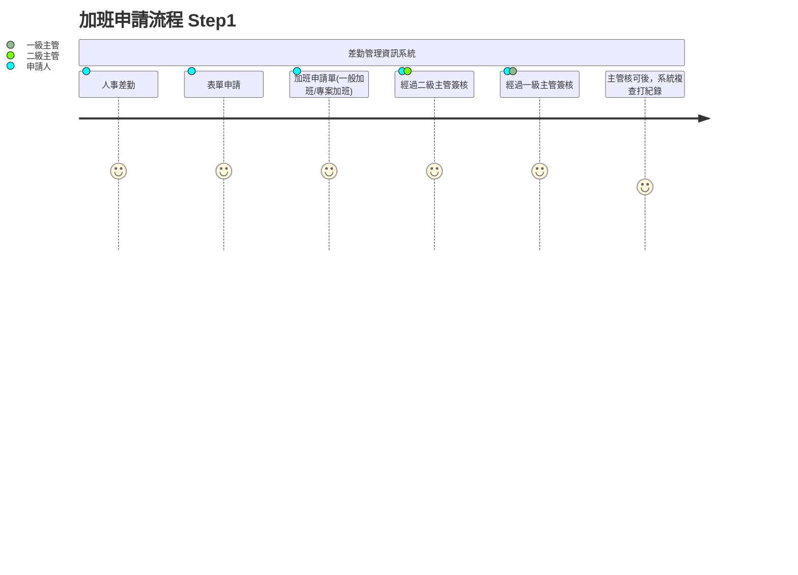
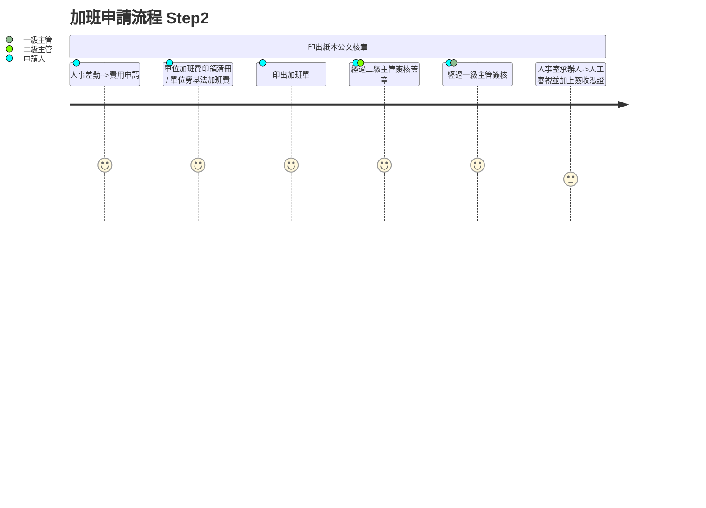
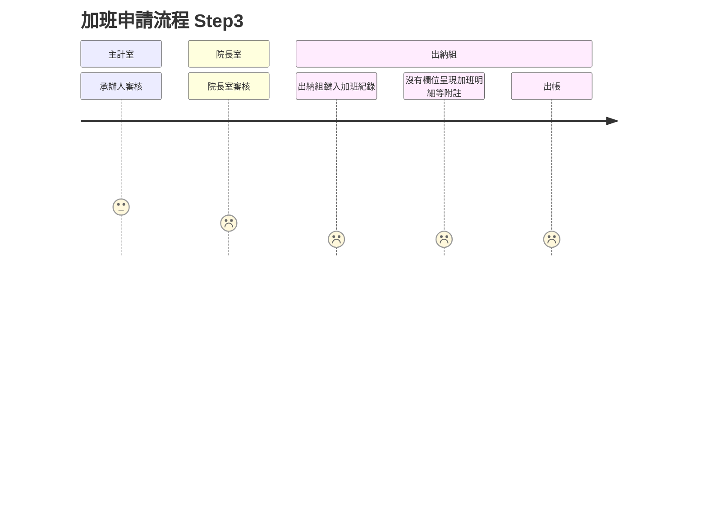

## 加班申請流程 Step1

```mermaid
journey
    title 加班申請流程 Step1
    section 差勤管理資訊系統
      人事差勤: 5: 申請人
      表單申請: 5: 申請人
      加班申請單(一般加班/專案加班): 5: 申請人
      經過二級主管簽核: 5: 申請人, 二級主管
      經過一級主管簽核: 5: 申請人, 一級主管
      主管核可後，系統複查打紀錄: 4

```
## 加班申請流程 Step2

```mermaid
journey
    title 加班申請流程 Step2
    section 印出紙本公文核章
      人事差勤-->費用申請: 4: 申請人
      單位加班費印領清冊 / 單位勞基法加班費印領清冊:4: 申請人
      印出加班單: 4: 申請人
      經過二級主管簽核蓋章: 4: 申請人, 二級主管
      經過一級主管簽核: 4: 申請人, 一級主管
      人事室承辦人->人工審視並加上簽收憑證:3


```
## 加班申請流程 Step3

```mermaid
journey
    title 加班申請流程 Step3
    section 主計室
      承辦人審核: 3
    section 院長室
      院長室審核: 2
    section 出納組
      出納組鍵入加班紀錄:1
      沒有欄位呈現加班明細等附註: 1
      出帳 :1

```
