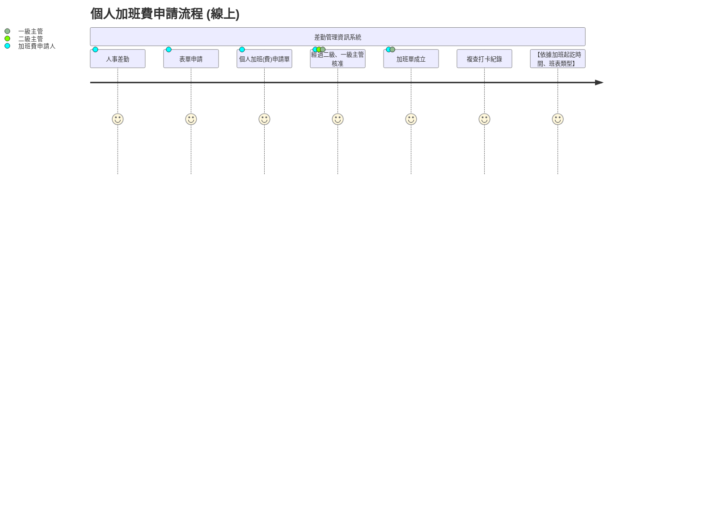
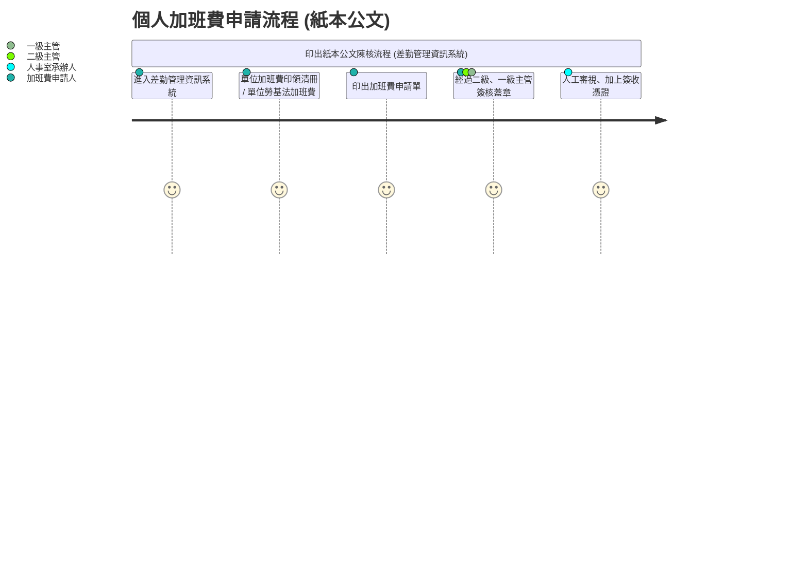
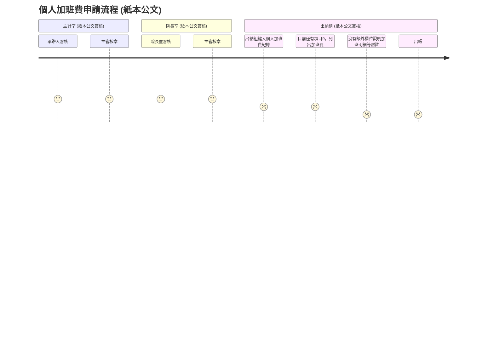

## 個人加班費申請流程

```mermaid
journey
    title 個人加班費申請流程 (線上)
    section 差勤管理資訊系統
      人事差勤: 5: 加班費申請人
      表單申請: 5: 加班費申請人
      個人加班(費)申請單: 5: 加班費申請人
      經過二級、一級主管核准: 5: 加班費申請人, 二級主管, 一級主管
      加班單成立: 5: 加班費申請人, 一級主管
      複查打卡紀錄: 5
      【依據加班起訖時間、班表類型】: 5

```

```mermaid
journey
    title 個人加班費申請流程 (紙本公文)
    section 印出紙本公文陳核流程 (差勤管理資訊系統)
      進入差勤管理資訊系統: 4: 加班費申請人
      單位加班費印領清冊 / 單位勞基法加班費印領清冊:4: 加班費申請人
      印出加班費申請單: 4: 加班費申請人
      經過二級、一級主管簽核蓋章: 4: 加班費申請人, 二級主管, 一級主管
      人工審視、加上簽收憑證: 4 : 人事室承辦人


```

```mermaid
journey
    title 個人加班費申請流程 (紙本公文)
    section 主計室 (紙本公文簽核)
      承辦人審核: 3
      主管核章: 3
    section 院長室 (紙本公文簽核)
      院長室審核: 3
      主管核章: 3
    section 出納組 (紙本公文簽核)
      出納組鍵入個人加班費紀錄:2
      目前僅有項目9，列出加班費:2
      沒有額外欄位說明加班明細等附註: 1
      出帳 :1

```
