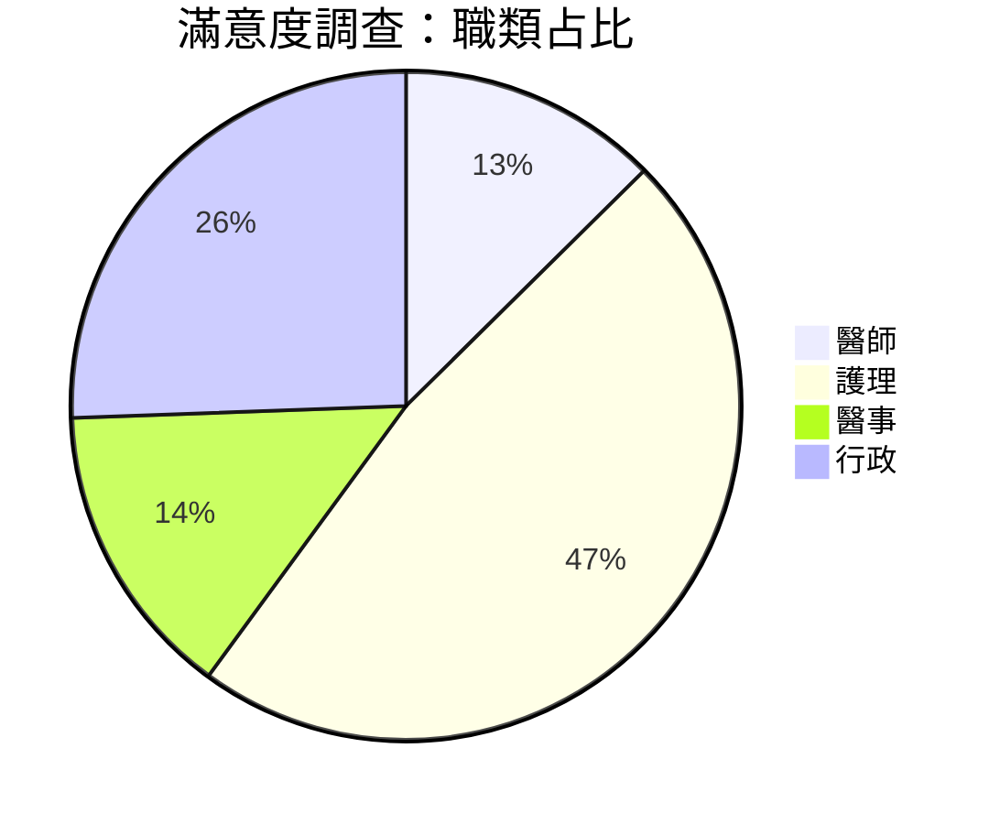
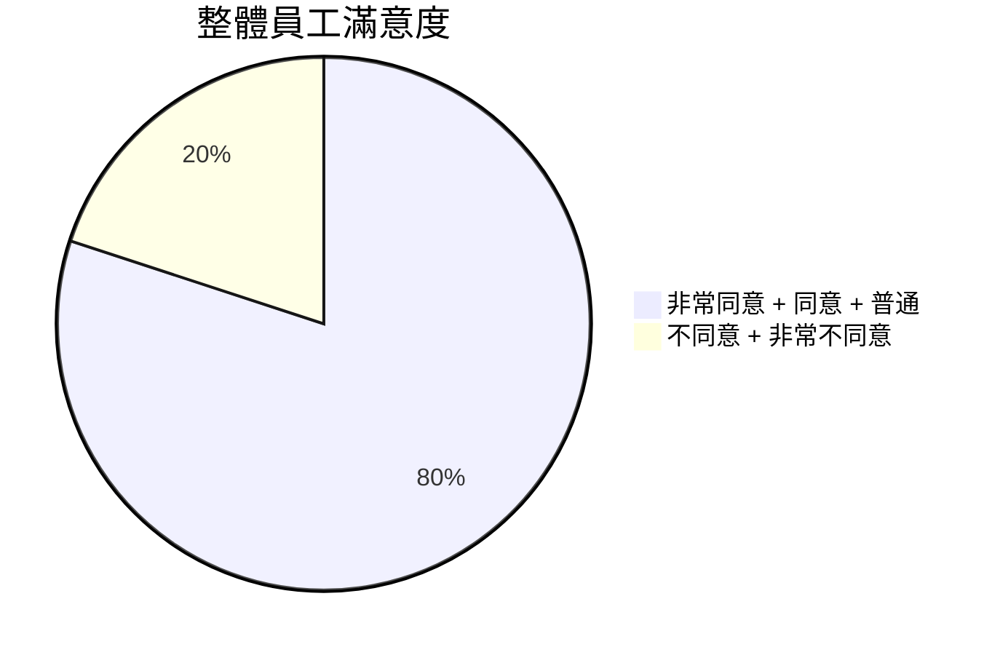
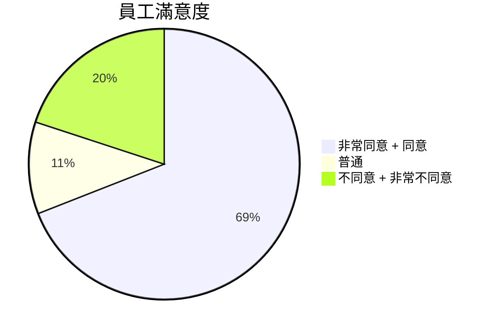
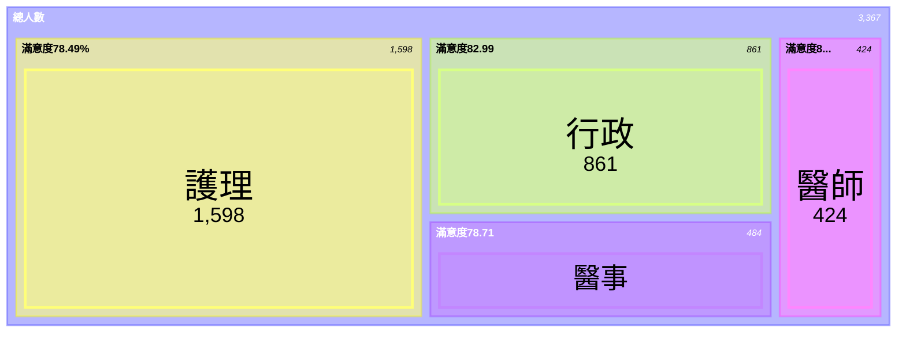

# 員工滿意度調查
---
## 總填答人次：3367
- 醫師 (人次)：424：13%
- 護理 (人次)：159：47%
- 醫事 (人次)：484：14%
- 行政 (人次)：861：26%

---
## 問卷可量化題目數：31
- 題目選項：**非常同意**、**同意**、**普通**、**不同意**、**非常不同意**
- 總填答人次：3367 **X** 問卷可量化題目數：31 **= 104377**

---
## 四大職類占比與職類滿意度：

