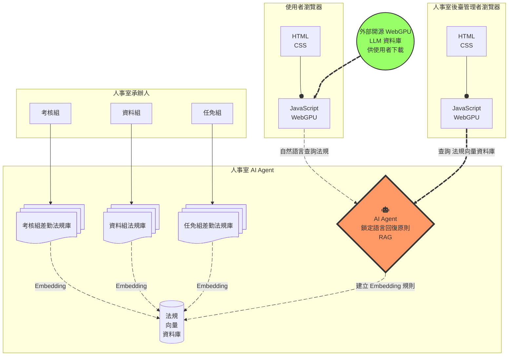

# 人事室智能小幫手 系統架構圖

```mermaid


graph TB
    subgraph 人事室 AI Agent 
        od@{ shape: docs, label: "考核組差勤法規庫"} 
        od e1@--Embedding --> ro
        od2@{ shape: docs, label: "資料組法規庫"}  
        od2 e2@--Embedding --> ro
        od3@{ shape: docs, label: "任免組差勤法規庫"}
        od3 e3@--Embedding --> ro
        e1@{ animate: true }
        e2@{ animate: true }
        e3@{ animate: true }
        ro[(法規<br>向量<br>資料庫)]
        di{"fa:fa-robot <br/> AI Agent <br/> 鎖定語言回復原則 <br/> RAG "}
        di e4@--建立 Embedding 規則--> ro
        e4@{ animate: true }     
    end

    subgraph 使用者瀏覽器
      od4[HTML<br>CSS] --o od5
      od5[JavaScript <br> WebGPU]
      od5 e5@--自然語言查詢法規--> di
      e5@{ animate: true }
    end

    subgraph 人事室後臺管理者瀏覽器
      od6[HTML<br>CSS] --o od7
      od7[JavaScript <br> WebGPU]
      od7 e6@==查詢 法規向量資料庫==> di
      e6@{ animate: true }
    end

e e7@==> od5
e7@{ animate: true }

e((外部開源 WebGPU <br> LLM 資料庫 <br> 供使用者下載))
    subgraph 人事室承辦人
      od8[考核組] --> od 
      od9[資料組] --> od2
      od10[任免組] --> od3
    end


     classDef green fill:#9f6,stroke:#333,stroke-width:2px;
     classDef orange fill:#f96,stroke:#333,stroke-width:4px;
     class sq,e green
     class di orange

```